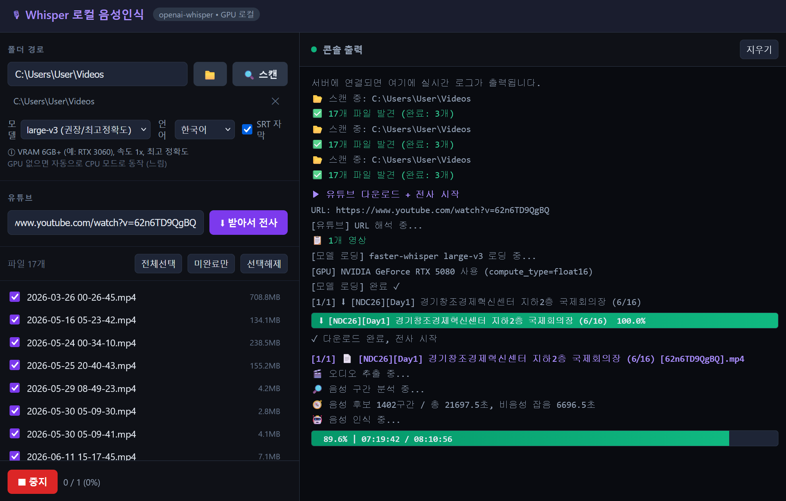

# transcribe-video

로컬 GPU로 강의 영상을 텍스트로 바꾸는 도구입니다. faster-whisper 전사에 더해,
한국어에서 자주 나오는 Whisper 환각을 걸러내는 다층 후처리와 유튜브 다운로드 전사
파이프라인을 직접 설계해 붙였습니다.



위 화면은 RTX 5080에서 large-v3 모델로 강의 영상 17개를 한 번에 전사하는 모습입니다.
왼쪽에서 로컬 폴더나 유튜브 URL로 영상 목록을 만들고, 오른쪽 콘솔에서 모델 로딩,
GPU, 진행률을 실시간으로 확인합니다.

## 왜 만들었나

강의 영상이 점점 쌓였습니다. 내용을 텍스트로 만들어 검색하고 빠르게 다시 보고
싶었지만, 막상 쓸 만한 방법이 마땅치 않았습니다.

상용 STT 서비스를 먼저 써봤습니다. 세 가지가 걸렸습니다.

- **비용과 업로드**: 영상이 길고 많을수록 비용이 커졌고, 영상을 외부 서버에 올려야
  했습니다.
- **한국어 환각**: 무음이나 잡음 구간에서 그럴듯한 가짜 문장(자막 크레딧, 같은 문구
  반복)을 만들어내는 문제가 한국어에서 특히 잦았습니다.
- **운영 번거로움**: 수십 개 파일을 한 번에, 중단했다가 이어서 처리하기가
  어려웠습니다.

그래서 직접 만들기로 했습니다. 목표는 분명했습니다. 내 PC의 GPU로, 무료로, 한국어
품질을 직접 손볼 수 있고, 일괄 처리와 이어하기, 유튜브까지 되는 도구입니다. 핵심은
모델을 가져다 쓰는 것 자체가 아니라, 모델이 내놓은 결과를 실제로 쓸 만한 품질로
끌어올리는 일이라고 봤습니다.

## 어떻게 해결했나

Whisper를 호출하는 것까지는 쉬웠습니다. 진짜 일은 그 다음부터였습니다. 실사용에서
부딪힌 문제를 하나씩 설계로 풀어낸 과정을 정리합니다.

### 1. 한국어 환각을 걸러내기

처음 결과물에는 사람이 말하지 않은 문장이 섞여 있었습니다. 무음 구간에 자막 크레딧
같은 문구가 나오거나, 같은 말이 멀리 떨어져 여러 번 반복됐습니다.

단순히 특정 단어를 막는 방식은 위험했습니다. 진짜 발화를 잘못 지울 수 있기
때문입니다. 그래서 성격이 다른 네 겹의 필터를 겹쳤습니다.

- **지표 기반**: avg_logprob, no_speech_prob, compression_ratio가 극단적으로 나쁘거나,
  긴 구간인데 글자 밀도가 낮은 세그먼트를 버립니다.
- **결정론적 반복 탐지**: 같은 텍스트가 여러 번 나오면서 반복 간격이 모두 수초 이상이면
  환각으로 봅니다. 환각은 같은 입력에 같은 출력을 내는 특성이 있어 멀리 떨어져
  반복됩니다. 진짜 발화 중의 추임새 반복과는 "모든 간격이 크다"는 조건으로 구분합니다.
- **관측 문구 정확 일치**: 실제로 본 환각 문자열만 그대로 막고, 정규식으로 일반화하지
  않습니다.
- **Whisper 내장 탐지**: word_timestamps와 hallucination_silence_threshold를 함께 켭니다.

여기서 한 가지를 명시적으로 선택했습니다. "더 많이 잡되 오삭제를 감수할 것인가,
보수적으로 가서 진짜 발화를 지킬 것인가"입니다. 오삭제가 더 치명적이라고 보고
보수적인 쪽을 택했고, 일반화 대신 관측된 사례만 막는 운영 방식으로 설계했습니다.

### 2. 무음 구간 건너뛰기 (직접 만든 음성 감지)

무음과 잡음을 그대로 전사에 넣으면 그게 환각의 입력이 되고 시간도 낭비됐습니다.
그래서 0.5초 단위로 RMS 에너지, zero-crossing rate, 스펙트럼 평탄도, 음성 대역
비율을 계산해 음성 구간만 추리는 분석기를 직접 구현하고, 그 구간만 Whisper에
넘겼습니다.

이 과정에서 분석 구간이 오디오 끝을 넘으면 Whisper가 무한 루프에 빠지는 버그를
만났습니다. 마지막 구간의 끝을 살짝 당기는 안전장치로 막았습니다.

### 3. 한글 경로가 깨지는 문제

두 군데에서 한글 경로가 깨졌고, 각각 다른 방식으로 풀었습니다.

- ffmpeg가 한글이 든 경로를 직접 열지 못하는 경우가 있어, 영상 파일을 Python에서 열어
  ffmpeg의 표준 입력으로 흘려보냈습니다.
- yt-dlp는 출력이 파이프로 연결되면 콘솔 코드페이지(cp949)로 인코딩해 한글 경로가
  깨졌습니다. `--encoding UTF-8`로 출력 인코딩을 맞춰 해결했습니다.

### 4. 실행본 빌드의 네이티브 크래시

배포는 자체 포함 실행본(PyInstaller onedir)으로 하기로 했는데, 빌드에서 두 번 크래시를
만났습니다.

- 요청 처리가 끝날 때 GC가 음성인식 모델을 해제하다가 "Fatal Python error: Aborted"로
  죽었습니다. 모델을 모듈 전역에 하나만 캐시해 해제 시점을 없앴고, 덤으로 재로딩
  비용도 줄였습니다.
- 음성인식 엔진과 PyTorch가 각자 OpenMP 런타임을 들고 있어, 빌드본에서 중복 로드되면
  종료 시점에 네이티브 abort가 났습니다. 진입 전에 환경변수로 고정해 막았습니다.

라이브러리 사용을 넘어 네이티브 레벨까지 추적해야 했던 부분입니다.

### 5. 진행률 실시간 스트리밍

faster-whisper의 transcribe는 generator를 돌려주고, 그 반복이 곧 추론입니다. 동기
반복이 비동기 서버를 막지 않도록, 추론은 워커 스레드에서 돌리고 각 결과를
asyncio 큐로 넘겨 WebSocket으로 즉시 전송했습니다. 추론과 전송을 분리해, 연결이
중간에 끊겨도 전사 자체는 끝까지 가도록 했습니다.

### 6. 빌드와 실행을 한 번으로 캡슐화하기

마지막으로, 소스를 받은 사람이 빌드와 실행을 따로 신경 쓰지 않게 만들고 싶었습니다.
루트에 `start.bat` 하나를 두고, 실행하면 소스가 바뀌었는지 내용 해시로 확인합니다.
바뀌었으면 새로 빌드하고, 그대로면 마지막 빌드를 실행한 뒤 서버를 띄우고 브라우저를
엽니다. 매번 빌드 명령과 실행 명령을 구분하지 않아도 되고, 같은 코드는 다시 빌드하지
않습니다. 다만 이 흐름은 빌드를 포함하므로 `uv` 같은 개발 도구가 설치된 환경을
전제합니다. 빌드 자체는 PyInstaller로 자체 포함 실행본(폴더 하나)을 만듭니다.

## 결과

- **로컬 폴더 일괄 전사**와 **유튜브 다운로드 전사**(단일 영상과 재생목록)
- **GPU 가속**: GPU가 있으면 float16, 없으면 CPU int8로 자동 전환
- **출력**: 원본 옆에 `.txt`, 선택 시 `.srt` 자막
- **실시간 진행률**과 **이어하기**(이미 처리한 파일은 건너뜀)
- **PyInstaller 실행본 패키징**과, 변경 시 자동 빌드 후 실행하는 **start.bat 진입점**

기술 스택은 Python, FastAPI, WebSocket, faster-whisper(CTranslate2), PyTorch(CUDA),
NumPy, ffmpeg, yt-dlp, PyInstaller입니다.

## 빠른 시작

사전 조건으로 `uv`가 설치돼 있어야 하고, `ffmpeg`가 PATH에 등록돼 있어야 합니다.

준비가 되면 루트의 `start.bat`을 더블클릭하면 됩니다. 처음 실행하거나 소스가
바뀌었으면 자동으로 빌드하고, 기존 빌드가 유효하면 마지막 빌드를 실행한 뒤 서버를
띄우고 브라우저(http://localhost:8765)를 엽니다. 최초 실행은 환경 준비와 빌드로 시간이
걸립니다.

## 구조

저장소는 문서와 진입점을 루트에 두고, 프로젝트 본체를 한 겹 아래 `transcribe-video/`에
모았습니다. 설계와 모듈별 상세는 [PROJECT.md](PROJECT.md)에 있습니다.

```
transcribe-video/            repo 루트
├── start.bat  start.ps1     사용자용 진입점 (변경 시 빌드 후 실행)
├── README.md  PROJECT.md  images/  docs/
└── transcribe-video/        프로젝트 (소스/빌드/venv)
    ├── pyproject.toml  uv.lock
    └── src/  tests/  scripts/  bin/
```

## 개발

개발할 때는 프로젝트 폴더에서 직접 다룹니다.

```
cd transcribe-video
uv venv
uv sync --group dev
```

- 서버: `uv run python src/server.py` (브라우저에서 http://localhost:8765)
- CLI: `uv run python src/transcribe_video.py <영상 또는 폴더> [--batch] [--srt]`
- 테스트: `uv run pytest`

빌드 산출물은 `transcribe-video/build/<타임스탬프>/whisper_server/`에 생성되고, 실행
시점에 PATH에 `ffmpeg`가 설치돼 있어야 합니다.

## 회고

이 프로젝트에서 배운 것은, 모델을 호출하는 코드보다 모델이 내놓은 결과를 실사용
품질로 끌어올리는 후처리와 운영 설계가 더 어렵고 더 중요하다는 점입니다. 환각 필터
하나를 두고도 "일반화로 더 많이 잡을 것인가, 보수적으로 오삭제를 막을 것인가"를
명시적으로 선택해야 했고, 자체 포함 실행본으로 패키징하기까지 네이티브 레벨의
크래시를 추적해 해결해야 했습니다. 라이브러리를 쓰는 데서 멈추지 않고, 실제로 쓰이는 도구가 갖춰야
할 견고함을 설계로 만들어낸 경험입니다.
